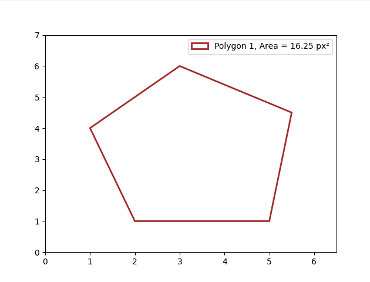

# API de Gestion de Polygones

## 📌 Description

Cette API permet aux utilisateurs de :

- Envoyer un fichier CSV contenant des coordonnées pour stocker des points dans une base de données
- Générer une représentation visuelle du polygone correspondant et calculer son aire en pixels carrés.

## 🛠 Technologies utilisées et choix techniques

### 1. **Backend : Python FastAPI & Pytest**
- **FastAPI** : Framework léger et asynchrone, particulièrement adapté pour la création d'API. Il offre une documentation automatique via Swagger, ce qui facilite la visualisation et l'interaction avec l'API. Il est très adapté pour ce petit projet.

- **Pytest** : Utilisé pour effectuer des tests unitaires et fonctionnels. Pytest génère des rapports de tests détaillés, permettant ainsi une surveillance efficace de la qualité du code et une validation continue de l’application.

### 2. **Frontend : HTML/CSS/JS**
- Initialement, j'avais l'intention d'utiliser **ReactJS** pour le frontend. Cependant, étant donné que la construction d'image était coûteuse pour un projet de cette envergure, j'ai opté pour une solution plus simple et légère, à savoir **HTML**, **CSS** et **JavaScript**. Cette approche garantit une interface fonctionnelle et efficace, sans complexité inutile.

### 3. **Base de données : PostgreSQL et PgAdmin**
- **PostgreSQL** a été choisi comme base de données relationnelle, car elle permet de garantir l'intégrité et la validation des formats de données tout en offrant une bonne évolutivité. Étant donné que l’application manipule des **polygones** constitués de **points**, deux tables ont été créées : une pour les polygones et une autre pour les points. L’**ID du polygone** est utilisé comme **clé étrangère** pour lier les points associés, assurant ainsi une relation claire entre ces éléments.

### 4. **Containerisation : Docker**
- **Docker** a été utilisé pour la **containerisation** de l’application. Cela permet une configuration, un build, et un déploiement homogènes et reproductibles, quelle que soit l’infrastructure. Docker facilite ainsi la gestion des environnements de développement et de production, assurant la portabilité de l’application.

## 5. **Bibliothèques notables pour le traitement des données**
- **Numpy** : Outil essentiel pour le traitement de données, **Numpy** permet de manipuler des structures de données complexes et de réaliser des calculs mathématiques sur des tableaux multidimensionnels.
- **SQLAlchemy** : Cette bibliothèque est utilisée pour la gestion des interactions avec la base de données. Elle facilite la validation des données et la gestion des requêtes SQL de manière plus fluide et orientée objet.
- **Matplotlib** : Utilisé pour la **visualisation** des données, **Matplotlib** permet de générer des graphiques et des plots, ce qui est particulièrement utile pour afficher des résultats visuels liés aux polygones ou à toute autre analyse spatiale.
- **Logging** : La bibliothèque **logging** de Python a été utilisée pour assurer un suivi complet du déroulement de l’application. Elle permet de générer des logs à différents niveaux (info, erreur, avertissement, etc.), ce qui est essentiel pour la surveillance, le débogage, et la gestion des erreurs au fur et à mesure que l’application s'exécute.


## 🚀 Installation Automatique via Docker

#### 📋 Prérequis

Avant d'exécuter l'application, assurez-vous:
* D'avoir installé Docker localement. J'ai utilisé la version v28.0.4 pour Docker, et v1.29.2 pour Docker-compose.
* D'avoir les ports 8080, 3000 et 5432 disponibles


### Installation & Execution

1. Cloner le dépôt :

   ```sh
   git clone https://github.com/ninetiop/polygon
   cd polygon/docker
   ```

2. Run le docker-compose.yml :

   ```sh
   docker-compose up --build 
   ```

3. Attendre la fin du build et ouvrir un browser à l'adresse suivante:
    ```sh
    http:localhost:3000
    ```


## 📌 Endpoints

FastAPI génère automatiquement une documentation interactive de l'API sur le endpoint /docs.

Ainsi, après le lancement de l'application, l'ensemble des informations et la possibilité de tester les endpoints sont accessibles à l'adresse http://localhost:8080/docs


### 1️⃣ Upload CSV

**POST** `/upload`

- **Description** : Permet d'envoyer un fichier CSV contenant des coordonnées pour traitement.
- **Paramètres** :
  - `csv_file` (**obligatoire**) : Fichier CSV à envoyer (format `multipart/form-data`).
- **Exemple de requête (cURL)** :

  ```sh
  curl -X 'POST' \
  'http://localhost:8080/upload' \
  -H 'accept: application/json' \
  -H 'Content-Type: multipart/form-data' \
  -F 'csv_file=@polygon.csv;type=text/csv'
  ```


- **Réponse (JSON)** :

  ```json
  {
    "message": "CSV uploaded successfully",
    "id": 1,
    "points": [
      {
        "x": 2,
        "y": 1,
        "comment": ""
      },
      {
        "x": 5,
        "y": 1,
        "comment": ""
      },
      {
        "x": 5.5,
        "y": 4.5,
        "comment": "was 5.3 before version 3.1.0"
      },
      {
        "x": 3,
        "y": 6,
        "comment": ""
      },
      {
        "x": 1,
        "y": 4,
        "comment": ""
      }
    ]
  }
  ```

### 2️⃣ Visualisation d'un Polygone

**GET** `/polygon/{id}`

- **Description** : Récupère les coordonnées et autres informations d'un polygone stocké dans la base de données.
- **Paramètres** :
  - `id` (**obligatoire**) : L'ID du polygone à récupérer.
- **Exemple de requête (cURL)** :

  ```sh
  curl -X 'GET' \
  'http://localhost:8080/polygon/1' \
  -H 'accept: application/json'
- **Réponse :

  

### 🧪 Tests

Pour lancer les tests unitaires / fonctionnels:
Les tests unitaires correspondent aux bonnes opérations avec la classe Database.
Les tests fonctionnels sont davantage portés sur des tests fonctionnels en testant les comportements des endpoints de l'API

1. Cloner le dépôt :

   ```sh
   git clone https://github.com/ninetiop/polygon
   cd polygon/backend/test
   ```

2. Run le docker-compose.yml :

   ```sh
   docker-compose up --build 
   ```

Un test est encore en erreur. L'erreur semble provenir d'une logique trop stricte lors de l'insertion des points. Actuellement, le code rejette tout polygone contenant des points déjà existants, sans vérifier s'ils appartiennent au même polygone.
L'objectif est de s'assurer que deux polygones distincts peuvent partager des points communs, tout en évitant les doublons dans un même polygone. C'est pourquoi la clé étrangère polygon_id doit être prise en compte lors de la validation des doublons.

### 🏗 Amélioration possible

#### 🚀 Inclusion d'un CI/CD via GitHub Actions  
Pour automatiser la validation et le déploiement de la solution sur le cloud (exemple : Azure), on pourrait intégrer un pipeline CI/CD avec des étapes d'action comme :  

1. Exécution des tests : Lancer les tests unitaires et fonctionnels du backend.  
- **Build des images** :  
  - Construction des images Docker pour chaque composant (backend, frontend, base de données).  
  - Construction d’une image globale regroupant tous les services.  
- **Publication sur DockerHub** : Envoi des images Docker sur un registre distant.  
- **Provisionnement cloud avec Terraform** : Automatisation de la création des ressources nécessaires à l'infrastructure cloud.  
- **Déploiement de la solution containerisée** : Mise en production automatique sur le cloud après validation.  

---

### Stratégie de branches et review de code  

- **Branches principales** :  
  - `main` → Code stable et validé.  
  - `dev` → Intégration des nouvelles fonctionnalités avant fusion dans `main`.  

- **Workflow** :  
  1. Développement sur une branche dédiée (`feature/xxx` ou `fix/xxx`).  
  2. Création d’une **pull request (PR)** pour fusionner dans `dev`, avec **review obligatoire**.  
  3. Tests automatiques (CI/CD) et validation du code.  
  4. Si tout est OK, **fusion dans `dev`**, puis **PR automatique vers `main`**.  
  5. Une fois validé, **déploiement automatique** en production.  

Cette approche garantit un code propre et testé avant d’aller en prod.

---

#### Ajout de fonctionnalités  
- **Ajout d’une description des polygones** : Permettre aux utilisateurs d'associer des métadonnées aux polygones (nom, type, usage, etc.).  
- **Support d'autres formats de fichiers** : Actuellement, seul le **CSV** est pris en charge, mais on pourrait supporter **JSON, GeoJSON, XML, etc.**  
- **Export des visualisations** : Offrir la possibilité de télécharger l'image du polygone générée.  
- **Statistiques sur les polygones** : Calculer des nouvelles métriques liés aux propriétés géométriques.  

---

### 📜 Licence

Ce projet est sous licence **MIT**.

**Auteur** : ninetiop


